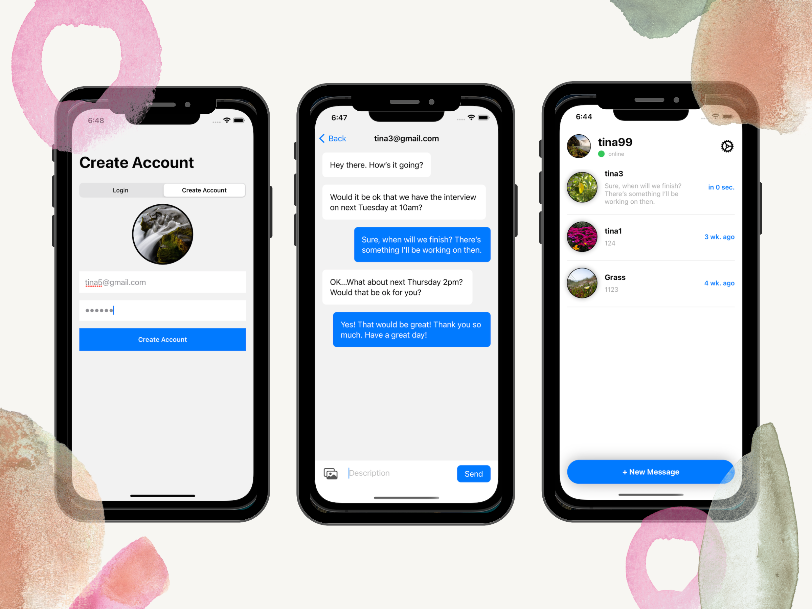

## About Me ✍️
Hey there, I'm Tina, a passionate self-taught iOS developer who's in love with creating products to enhance daily lives of yours and mine.

## Portfolio ☕
#### Fetch current users and personal chat contents from Firebase and Firestore as well as storing them.

  

 

- Create a Login Page
  - Installing Firestore and Saving User Data Collection
- Main Messages View
  - Fetch Current User Firestore
  - Sign out of Firebase
- Chat Log Sending Messages
  - Show All Users for Creating Message
  - Navigation Link to Chat Log View
  - Chat Log UI Setup
  - Send and Save Messages to Firestore
  - Fetch Messages Documents with Snapshot Listener
- Recent Main Messages
  - Save and Fetch Recent Messages
  - Removing Snapshot Listeners

## Language & Tools I Experienced In☕

      

